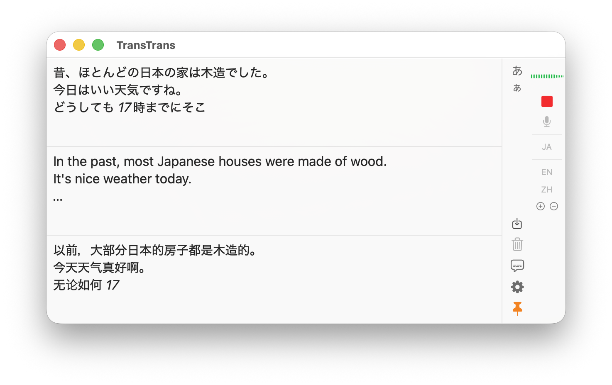
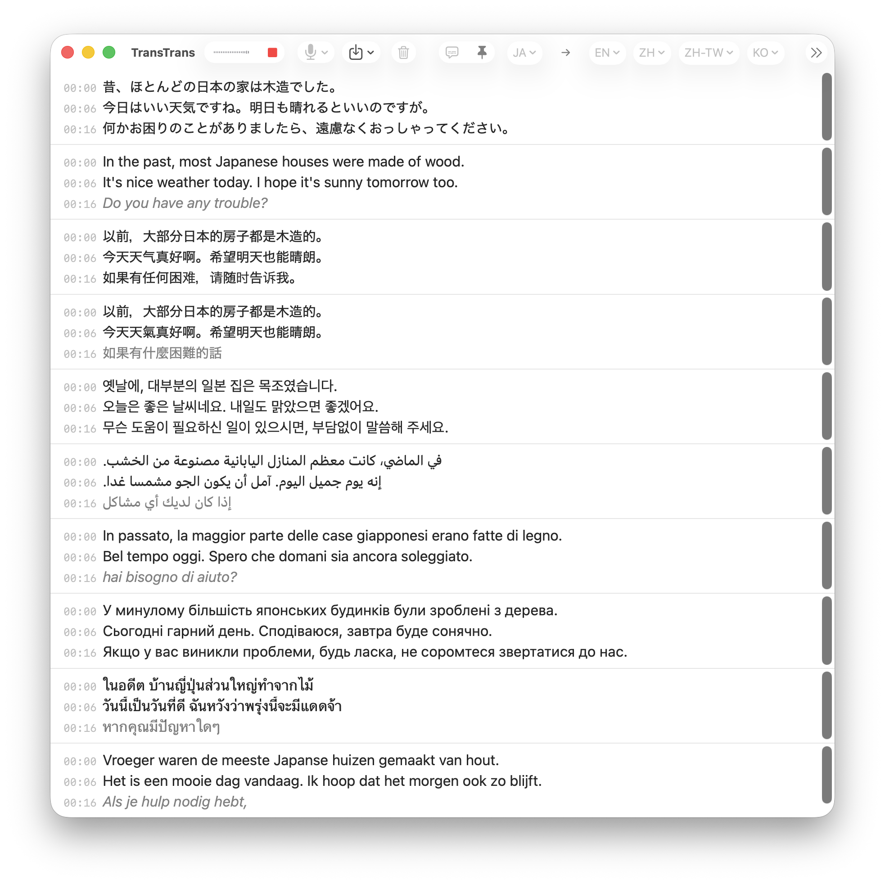
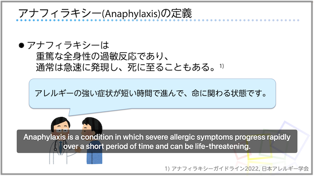

# TransTrans

A macOS application for real-time speech transcription and translation. TransTrans captures microphone audio, transcribes speech using Apple's Speech framework, and translates it into a target language using Apple's Translation framework — all in real-time.

## Features

- **Real-time transcription** — Live speech-to-text using Apple's Speech framework with progressive transcription
- **Automatic translation** — Instant translation of transcribed text via Apple's Translation framework
- **Multi-target language support** — Translate into up to 10 target languages simultaneously, with one-click language swap (⌘⇧S)

- **Audio level visualization** — Color-coded waveform display (green/orange/red)
- **Always-on-top mode** — Keep the window above other applications (⌘T)
- **Subtitle mode** — Movie-style subtitle overlay at the bottom of the screen, showing translation only (⌘D); lines auto-expire after 30 seconds

- **Audio file transcription** — Transcribe existing audio files (WAV, MP3, M4A, AIFF) via File → Transcribe Audio File (⌘O)
- **Export** — Save transcripts as text or subtitles (.srt / .vtt), and export audio recordings (.m4a)

## Requirements

- macOS 26 or later
- Microphone access

## Tips for Better Recognition

- **Use a good microphone** — A dedicated external microphone or headset significantly improves accuracy over built-in laptop microphones.
- **Keep a quiet environment** — Background noise (air conditioning, music, conversation) degrades recognition quality. Use a directional microphone if possible.
- **Speak clearly at a steady pace** — Avoid speaking too quickly or mumbling. Slight pauses between sentences help the recognizer segment text correctly.
- **Stay close to the microphone** — Keep a consistent distance of 15–30 cm from the microphone. Too far reduces signal quality; too close may cause clipping.
- **Check audio levels** — Use the audio level indicator in TransTrans to verify that your microphone is picking up speech at an appropriate level. Green is good; consistently red indicates the signal is too loud.

## Recognizing Audio from Your Computer

TransTrans captures audio from a microphone input. To transcribe audio playing on your Mac (e.g., a video call, a lecture video), you have two options:

### Option 1: macOS Live Captions (simplest)

macOS has built-in Live Captions that can transcribe system audio directly. Go to **System Settings → Accessibility → Live Captions** and enable it. Note that Live Captions only displays the original language — it does not translate.

### Option 2: Virtual Audio Device (for translation)

To route system audio into TransTrans for both transcription and translation, use a virtual audio loopback driver such as [BlackHole](https://existential.audio/blackhole/):

1. Install BlackHole (2ch is sufficient).
2. Open **Audio MIDI Setup** (in /Applications/Utilities).
3. Create a **Multi-Output Device** that includes both your speakers/headphones and BlackHole.
4. Set this Multi-Output Device as your system output.
5. In TransTrans, select **BlackHole** as the microphone input (via Transcription → Microphone menu).

This way, system audio is sent to both your speakers and TransTrans simultaneously.

## Privacy

TransTrans processes all speech and translation **on your device**. Your audio and text are not sent to external servers.

- **Translation** — Apple's Translation framework documentation states: *"All translations using the `TranslationSession` class are processed on the user's device."* Apple may collect API usage metrics (such as app bundle ID and language pair) but does not collect the original or translated content.
- **Speech recognition** — TransTrans uses the on-device `SpeechTranscriber` / `SpeechAnalyzer` API with locally downloaded models. Audio data is processed entirely on your device.

## Supported Languages

Available languages depend on the models Apple provides for each framework. Language availability may vary by region and OS version.

- **Speech recognition** — See [Apple Speech Framework documentation](https://developer.apple.com/documentation/speech)
- **Translation** — See [Apple Translation Framework documentation](https://developer.apple.com/documentation/translation)

## Keyboard Shortcuts

| Shortcut | Action |
|---|---|
| ⌘R | Start / Stop transcription |
| ⌘O | Transcribe audio file |
| ⌘S | Save both (interleaved) |
| ⌘⇧S | Swap source and target languages |
| ⌘D | Toggle subtitle mode |
| ⌘T | Toggle always-on-top |
| ⌘+ | Increase font size |
| ⌘− | Decrease font size |
| ⌘, | Settings (custom vocabulary) |

## Language Models

TransTrans uses on-device models for both speech recognition and translation.
Models are downloaded automatically when you select a language that is not yet
installed — a cloud icon (☁️↓) indicates languages that need downloading, and a
progress indicator appears during download.

### Managing Downloaded Models

- **Translation models** — Open **System Settings → General → Language & Region → Translation Languages** to view, download, or remove translation language packs.
- **Speech recognition models** — Managed automatically by the system. There is no user-facing UI to delete them. The system may reclaim storage for models that have not been used recently.

## Troubleshooting

### Microphone is not recognized / No audio input
- Open **System Settings → Privacy & Security → Microphone** and ensure TransTrans has permission.
- Check that the correct microphone is selected in the **Transcription → Microphone** menu.
- If using an external microphone, verify it is properly connected and recognized by the system (check **System Settings → Sound → Input**).

### Transcription does not start
- Ensure **System Settings → Privacy & Security → Speech Recognition** permission is granted to TransTrans.
- The speech model for the selected language may still be downloading. Wait for the cloud icon (☁️↓) to disappear.

### Translation is not displayed
- The translation model may not be downloaded yet. Go to **System Settings → General → Language & Region → Translation Languages** and download the required language pair.
- Some language combinations may not be supported. Try a different language pair.

### Poor recognition accuracy
- See [Tips for Better Recognition](#tips-for-better-recognition) above.
- Try adding domain-specific words to **Custom Vocabulary** in Settings (⌘,). Note that custom vocabulary provides hints to the recognition engine and may not always be prioritized.
- Use **Auto Replace** rules in Settings to correct frequently misrecognized words.

## Feedback & Bug Reports

Found a bug or have a suggestion? Please report it on [GitHub Issues](https://github.com/kcrt/TransTrans/issues). You can also access this link from the app's **Help** menu.

## Documentation

Technical documentation (architecture, audio pipeline, translation pipeline, etc.) is available in the [`docs/`](docs/) directory.

## License

All rights reserved.
